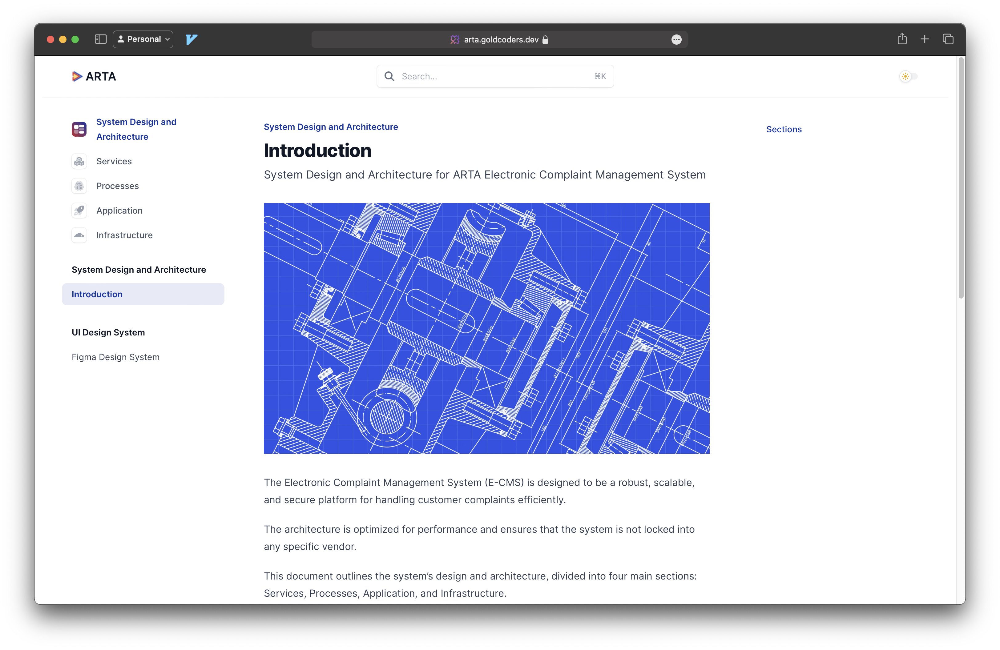

# ARTA ECMS Docs

> Currently Deployed at https://arta.goldcoders.dev



### Development

Install the [Mintlify CLI](https://www.npmjs.com/package/mintlify) to preview the documentation changes locally. To install, use the following command

```
npm i -g mintlify
```

Run the following command at the root of your documentation (where mint.json is)

```
mintlify dev
```

### Publishing Changes

Install our Github App to autopropagate changes from youre repo to your deployment. Changes will be deployed to production automatically after pushing to the default branch. Find the link to install on your dashboard.

#### Troubleshooting

- Mintlify dev isn't running - Run `mintlify install` it'll re-install dependencies.
- Page loads as a 404 - Make sure you are running in a folder with `mint.json`
