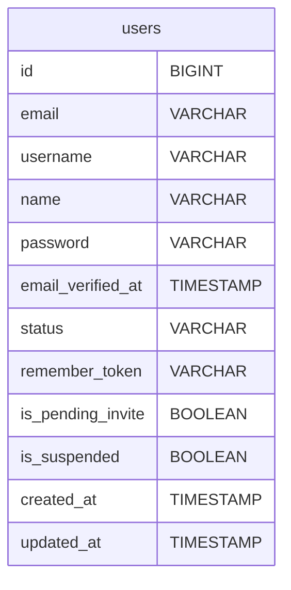
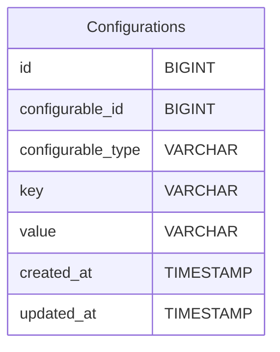
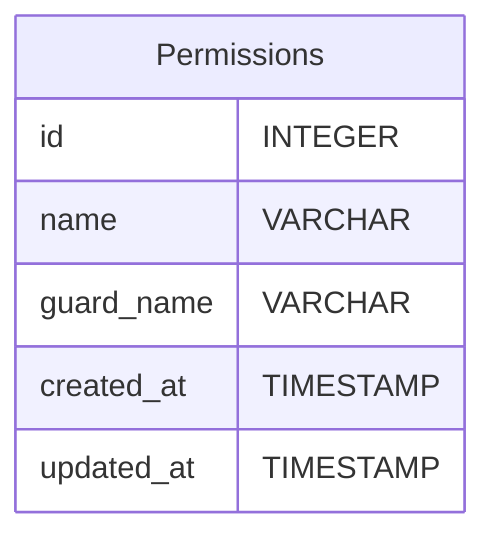
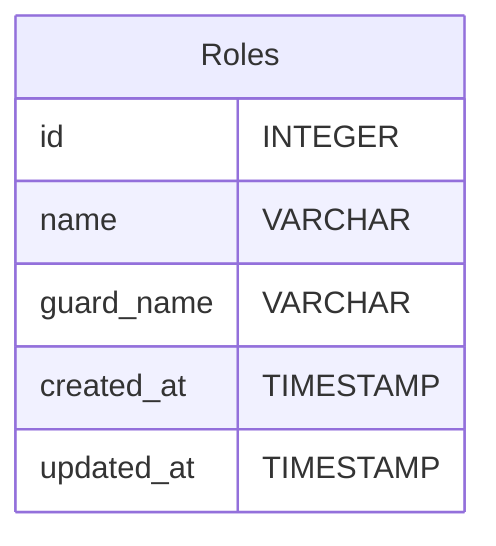
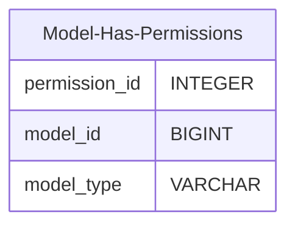
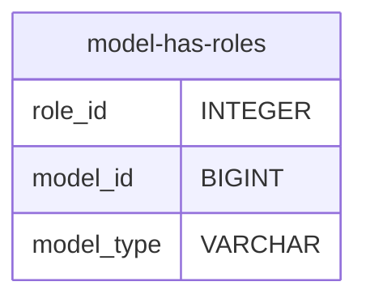
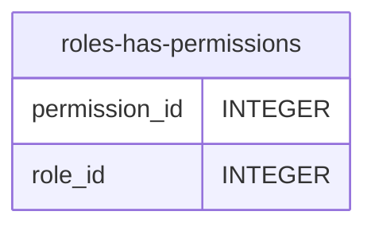
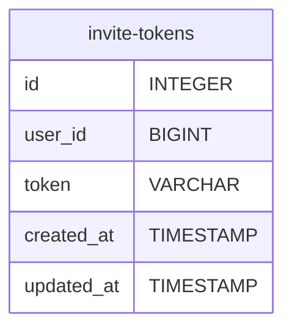

## Database Schema Overview

The Database Schema of the Electronic Complaint Management System (E-CMS) is a meticulously structured foundation that underpins the entire application. This schema not only defines how data is stored and organized but also represents the relationships between different entities within the system. It is crucial for maintaining data integrity, ensuring efficient data retrieval and storage, and supporting the complex functionalities of the E-CMS.

Our database schema has been designed with scalability and flexibility in mind, allowing for future enhancements and modifications as the system evolves. It incorporates various tables, each serving a distinct purpose, from managing user information and roles to handling issues, notifications, and workflows.

### Key Considerations

1. **Normalization**: To reduce redundancy and improve data integrity, the schema is highly normalized. This approach ensures that the data is stored in a way that minimizes duplication and promotes consistency.

2. **Relationships and Constraints**: The schema defines clear relationships between different entities using foreign keys and enforces data integrity through various constraints. This design helps in maintaining a high level of data quality and accuracy.

3. **Indexing for Performance**: Key attributes in the tables are indexed to optimize query performance, particularly essential for handling large volumes of data efficiently.

4. **Modular and Extensible**: The schema is modular, allowing for isolated updates and enhancements without impacting the overall system. This modularity also aids in the extensibility of the system, accommodating new features and functionalities as needed.

5. **Security and Privacy**: Sensitive data, especially user-related information, is handled with utmost security. Measures such as encryption and access controls are implemented to protect data privacy and security.

With these principles, the E-CMS database schema is not just a data repository but a dynamic, integral part of the system that supports and enhances the application's capabilities.

## Detailed Schema Listings

The following sections provide an exhaustive overview of the various tables and their structures within the E-CMS database. Each table is accompanied by a description of its fields, data types, and the role it plays in the overall system.


### Users:
- id (Big Integer, Primary Key): Auto-incrementing ID.
- email (VARCHAR, Nullable, Unique): User's email address, which can be empty. Indexed for faster lookups.
- username (VARCHAR, Unique): User username used for tagging and assigning issues.
- name (VARCHAR, Nullable): User's full name.
- password (VARCHAR, Nullable): Hashed password, which can be empty.
- email_verified_at (Timestamp, Nullable): Timestamp indicating when the user's email was verified.
- status (VARCHAR, Nullable): Current status of the user, indexed for faster querying.
- remember_token (VARCHAR): A token used for "remember me" functionality in authentication.
- created_at (Timestamp): Timestamp of when the record was created.
- updated_at (Timestamp): Timestamp of when the record was last updated.


<Tabs>
  <Tab title="image">


  </Tab>
  <Tab title="code">
    <CodeGroup>


</CodeGroup>
  </Tab>
</Tabs>


### Configuration

- id (Big Integer, Primary Key): Auto-incrementing ID.
- configurable_id  (Big Integer): The ID of the entity to which this configuration entry applies. This ID would correspond to an ID in the Users, Teams, or Workspaces table, depending on the configurable_type.
- configurable_type: A string indicating the type of the entity. This helps the application understand which table (Users, Teams, Workspaces) to join with this configuration record.
- key: The configuration setting's name (e.g., 'notification_preference', 'stale_issue_duration').
- value: The value for the configuration setting.
- created_at: The timestamp when the configuration entry was created.
- updated_at: The timestamp when the configuration entry was last updated.

<Tabs>
  <Tab title="image">


  </Tab>
  <Tab title="code">
    <CodeGroup>


</CodeGroup>
  </Tab>
</Tabs>


### Permissions:
- id (Primary Key, Integer): Unique identifier for each permission.
- name (VARCHAR): Name of the permission.
- guard_name (VARCHAR): Guard name for the permission.
- created_at (Timestamp): Timestamp of when the permission was created.
- updated_at (Timestamp): Timestamp of when the permission was last updated.

<Tabs>
  <Tab title="image">


  </Tab>
  <Tab title="code">
    <CodeGroup>


</CodeGroup>
  </Tab>
</Tabs>


### Roles:
- id (Primary Key, Integer): Unique identifier for each role.
- name (VARCHAR): Name of the role.
- guard_name (VARCHAR): Guard name for the role.
- created_at (Timestamp): Timestamp of when the role was created.
- updated_at (Timestamp): Timestamp of when the role was last updated.

<Tabs>
  <Tab title="image">


  </Tab>
  <Tab title="code">
    <CodeGroup>



</CodeGroup>
  </Tab>
</Tabs>


### Model Has Permissions:
- permission_id (Integer, Foreign Key): Reference to the permission.
- model_type (VARCHAR): Type of the model (e.g., 'User').
- model_id (Big Integer): ID of the model.

<Tabs>
  <Tab title="image">


  </Tab>
  <Tab title="code">
    <CodeGroup>

</CodeGroup>
  </Tab>
</Tabs>

### Model Has Roles:
- role_id (Integer, Foreign Key): Reference to the role.
- model_type (VARCHAR): Type of the model (e.g., 'User').
- model_id (Big Integer): ID of the model.

<Tabs>
  <Tab title="image">


  </Tab>
  <Tab title="code">
    <CodeGroup>



</CodeGroup>
  </Tab>
</Tabs>


### Role Has Permissions:
- permission_id (Integer, Foreign Key): Reference to the permission.
- role_id (Integer, Foreign Key): Reference to the role.

<Tabs>
  <Tab title="image">


  </Tab>
  <Tab title="code">
    <CodeGroup>



</CodeGroup>
  </Tab>
</Tabs>


### Invite Tokens:
- id (Primary Key, Integer): Auto-incrementing ID.
- user_id (Unsigned Big Integer, Indexed): Foreign key that references the id in the users table. Indexed for efficient querying.
- token (VARCHAR, Indexed): A unique token used for the invitation process. It is indexed and set as unique to ensure that each token is distinct.
- created_at (Timestamp): Timestamp of when the invite token was created.
- updated_at (Timestamp): Timestamp of when the invite token was last updated.

<Tabs>
  <Tab title="image">


  </Tab>
  <Tab title="code">
    <CodeGroup>


</CodeGroup>
  </Tab>
</Tabs>


### Password Resets:
- email (VARCHAR): Email address of the user requesting the password reset. This field is indexed for efficient querying.
- token (VARCHAR): A unique token generated for the password reset process.
- created_at (Timestamp, Nullable): Timestamp of when the password reset request was created.

<Tabs>
  <Tab title="image">


  </Tab>
  <Tab title="code">
    <CodeGroup>

```mermaid schema.mdd


```
</CodeGroup>
  </Tab>
</Tabs>


### Social Accounts:

- id (Primary Key, Big Integer): Auto-incrementing ID.
- user_id (Unsigned Big Integer, Indexed): Foreign key that references the id in the users table. Indexed for efficient querying.
- provider (VARCHAR, Indexed): The name of the social media provider (e.g., Google, Facebook).
- provider_id (VARCHAR, Indexed): The unique identifier for the user as provided by the social media service.
- created_at (Timestamp): Timestamp of when the social account link was created.
- updated_at (Timestamp): Timestamp of when the social account link was last updated.

<Tabs>
  <Tab title="image">
    
    
  </Tab>
  <Tab title="code">
    <CodeGroup>
      ```mermaid social-accounts.mmd
      erDiagram
        social-accounts {
            id BIGINT
            user_id BIGINT
            provider VARCHAR
            provider_id VARCHAR
            created_at TIMESTAMP
            updated_at TIMESTAMP
        }
      ```
    </CodeGroup>
  </Tab>
</Tabs>


### Sessions:

- id (Primary Key, Integer or Big Integer): Auto-incrementing ID for each session.
- user_id (Foreign Key to Users table, Integer or Big Integer): ID linking to the user.
- token (VARCHAR): The JWT token generated upon successful authentication.
- ip_address (VARCHAR, Nullable): IP address of the user for additional security tracking (optional).
- user_agent (VARCHAR, Nullable): Records the browser or device used during the session (optional).
- refresh_token (VARCHAR, Nullable): Token used for renewing the session without re-authentication (optional).
- expires_at (Timestamp): Timestamp indicating when the token expires.
- created_at (Timestamp): Timestamp of when the session record was created.

<Tabs>
  <Tab title="image">
    
    
  </Tab>
  <Tab title="code">
    <CodeGroup>
      ```mermaid
      erDiagram
          sessions {
              id BIGINT
              user_id BIGINT
              token VARCHAR
              ip_address VARCHAR
              user_agent VARCHAR
              refresh_token VARCHAR
              expires_at TIMESTAMP
              created_at TIMESTAMP
          }
      ```
    </CodeGroup>
  </Tab>
</Tabs>


### Issues:

- id (Big Integer, Primary Key): Auto-incrementing ID for each issue.
- title (VARCHAR): Title of the issue, representing the allegation or violation.
- description (TEXT): Detailed description of the issue.
- priority_id (INTEGER, Foreign Key, Nullable): Reference to the priority of the issue (if applicable).
- ir_id (INTEGER, Foreign Key, Nullable): Reference to the Issue Timeframe Resolution for the team handling this issue (if applicable).
- assignee_id (Big Integer, Foreign Key, Nullable): Reference to the current user who is assigned to the issue (from the Users table).
- complainee_id (Big Integer, Foreign Key, Nullable): Reference to the complained agency (from the Complainees table).
- complainant_id (Big Integer, Foreign Key): Reference to the complainant (from the Complainants table).
- due_date (Timestamp, Nullable): Timestamp indicating the due date for the issue (if applicable).
- received_via (VARCHAR, Nullable): Text field indicating how the issue was received (e.g., mail, email, Facebook, web).
- created_at (Timestamp): Timestamp of when the issue record was created.
- updated_at (Timestamp): Timestamp of when the issue record was last updated.

<Tabs>
  <Tab title="image">
    
    
  </Tab>
  <Tab title="code">
    <CodeGroup>
      ```mermaid
      erDiagram
        issues {
          id BIGINT
          title VARCHAR
          description TEXT
          priority VARCHAR
          status_id BIGINT
          ir_id BIGINT
          assignee_id BIGINT
          team_id BIGINT
          complainee_id BIGINT
          complainant_id BIGINT
          due_date TIMESTAMP
          received_via VARCHAR
          creator_id BIGINT
          created_at TIMESTAMP
          updated_at TIMESTAMP
        }
      ```
    </CodeGroup>
  </Tab>
</Tabs>


### Agencies:
- id (Primary Key, Integer or Big Integer): Auto-incrementing ID, uniquely identifying each government agency.
- name (VARCHAR): The name of the government agency.
- description (Text, Nullable): A text field providing a detailed description of the government agency.
- abbreviation (VARCHAR, Nullable): Abbreviation of the government agency.
- created_at (Timestamp): Timestamp of when the agency was created.
- updated_at (Timestamp): Timestamp of when the agency was last updated.

<Tabs>
  <Tab title="image">
    
    
  </Tab>
  <Tab title="code">
    <CodeGroup>
      ```mermaid
      erDiagram
          agencies {
              id BIGINT
              name VARCHAR
              description TEXT
              abbreviation VARCHAR
              created_at TIMESTAMP
              updated_at TIMESTAMP
          }
      ```
    </CodeGroup>
  </Tab>
</Tabs>


### Violations:
- id (Primary Key, Integer or Big Integer): Auto-incrementing ID, uniquely identifying each violation.
- name (VARCHAR): The name of the violation.
- description (Text, Nullable): A text field providing a detailed description of the violation.
- code (VARCHAR, Nullable): Violation code used in forms.
- created_at (Timestamp): Timestamp of when the violation was created.
- updated_at (Timestamp): Timestamp of when the violation was last updated.

<Tabs>
  <Tab title="image">
    
    
  </Tab>
  <Tab title="code">
    <CodeGroup>
      ```mermaid
      erDiagram
          violations {
              id BIGINT
              name VARCHAR
              description TEXT
              code VARCHAR
              created_at TIMESTAMP
              updated_at TIMESTAMP
          }
      ```
    </CodeGroup>
  </Tab>
</Tabs>


### Issue Violations (Pivot)
- id (Foreign Key, Integer or Big Integer): ID linking to the specific violation.
- issue_id (Foreign Key, Integer or Big Integer): ID linking to the issue.
- created_at (Timestamp): Timestamp of when the user-team relationship was created.
- updated_at (Timestamp): Timestamp of when the user-team relationship was last updated.

<Tabs>
  <Tab title="image">
    
    
  </Tab>
  <Tab title="code">
    <CodeGroup>
      ```mermaid
      erDiagram
          issue-violation {
              id BIGINT
              issue_id BIGINT
              violation_id BIGINT
              created_at TIMESTAMP
              updated_at TIMESTAMP
          }
      ```
    </CodeGroup>
  </Tab>
</Tabs>


### Complainants:
- id (Primary Key, Integer or Big Integer): Auto-incrementing ID.
- name (VARCHAR): The name of the complainant.
- address (Text): The address of the complainant.
- email (VARCHAR, Nullable): The email address of the complainant.
- contact_number (VARCHAR): The contact number of the complainant.
- gender (VARCHAR, Nullable): The gender of the complainant.
- referral (VARCHAR, Nullable): Information about who is filling out the complaint.
- is_anonymous (Boolean): Indicates if the profile was filled out anonymously.
- created_at (Timestamp): Timestamp of when the complainant was created.
- updated_at (Timestamp): Timestamp of when the complainant was last updated.

<Tabs>
  <Tab title="image">
    
    
  </Tab>
  <Tab title="code">
    <CodeGroup>
      ```mermaid
      erDiagram
          complainants {
              id BIGINT
              name VARCHAR
              address TEXT
              email VARCHAR
              contact_number VARCHAR
              gender VARCHAR
              referral VARCHAR
              is_anonymous BOOLEAN
              created_at TIMESTAMP
              updated_at TIMESTAMP
          }
      ```
    </CodeGroup>
  </Tab>
</Tabs>


### Complainees:
- id (Primary Key, Integer or Big Integer): Auto-incrementing ID.
- agency_id (Foreign Key, Integer or Big Integer): References the id in the government_agencies table.
- name (VARCHAR): The name of the complainee.
- branch (VARCHAR, Nullable): The specific branch or division of the agency.
- created_at (Timestamp): Timestamp of when the complainees was created.
- updated_at (Timestamp): Timestamp of when the complainees was last updated.

<Tabs>
  <Tab title="image">
    
    
  </Tab>
  <Tab title="code">
    <CodeGroup>
      ```mermaid
      erDiagram
          complainees {
              id BIGINT
              agency_id BIGINT
              name VARCHAR
              branch VARCHAR
              created_at TIMESTAMP
              updated_at TIMESTAMP
          }
      ```
    </CodeGroup>
  </Tab>
</Tabs>


### Links:
- id (Primary Key, Integer or Big Integer): Unique identifier for each link.
- issue_id (Foreign Key, Integer or Big Integer): Links to a specific issue.
- user_id (Foreign Key, Integer or Big Integer): Identifies the user who added the link.
- url (VARCHAR): The actual URL of the link.
- description (Text, Nullable): Additional context or information about the link.
- created_at (Timestamp): Timestamp when the link was created.
- updated_at (Timestamp): Timestamp when the link was last updated.
- deleted_at (Timestamp, Nullable): Indicates when the link was marked as 'deleted' for soft deletion.

<Tabs>
  <Tab title="image">
    
    
  </Tab>
  <Tab title="code">
    <CodeGroup>
      ```mermaid
      erDiagram
          links {
              id BIGINT
              issue_id BIGINT
              user_id BIGINT
              url VARCHAR
              description TEXT
              created_at TIMESTAMP
              updated_at TIMESTAMP
              deleted_at TIMESTAMP
          }
      ```
    </CodeGroup>
  </Tab>
</Tabs>


### Workflows:
- id (INTEGER, Primary Key): Unique identifier for each workflow.
- name (VARCHAR): The name of the workflow, such as 'Default Team Workflow'.
- team_id (INTEGER, Foreign Key): Reference to the team that uses the workflow.
- created_at (Timestamp): Timestamp when the workflow was created.
- updated_at (Timestamp): Timestamp when the workflow was last updated.

<Tabs>
  <Tab title="image">
    
    
  </Tab>
  <Tab title="code">
    <CodeGroup>
      ```mermaid
      erDiagram
          workflows {
              id INTEGER
              name VARCHAR
              team_id INTEGER
              created_at TIMESTAMP
              updated_at TIMESTAMP
          }
      ```
    </CodeGroup>
  </Tab>
</Tabs>


### Status Categories:

- id (INTEGER, Primary Key): Unique identifier for each status category.
- name (VARCHAR): The name of the category, like 'Backlog', 'Started', etc.
- icon (VARCHAR): Icon URL or identifier for the category.
- description (TEXT): A brief description of the category.
- order (INTEGER): The order in which the category appears in the workflow.
- created_at (Timestamp): Timestamp when the category was created.
- updated_at (Timestamp): Timestamp when the category was last updated.

<Tabs>
  <Tab title="image">
    
    
  </Tab>
  <Tab title="code">
    <CodeGroup>
      ```mermaid
      erDiagram
          status-categories {
              id INTEGER
              name VARCHAR
              icon VARCHAR
              description TEXT
              order INTEGER
              created_at TIMESTAMP
              updated_at TIMESTAMP
          }
      ```
    </CodeGroup>
  </Tab>
</Tabs>


### Statuses:
- status_id (INTEGER, Primary Key): Unique identifier for each status.
- name (VARCHAR): The name of the status, such as 'In Progress', 'Done', etc.
- description (TEXT): A brief description of the status.
- icon (VARCHAR): Icon URL or identifier for the status.
- color (VARCHAR): Color code for the status.
- order (INTEGER): The order in which the status appears in the workflow.
- is_default (BOOLEAN): Indicates whether the status is the default within its category.
- category_id (INTEGER, Foreign Key): Reference to the status category.

<Tabs>
  <Tab title="image">
    
    
  </Tab>
  <Tab title="code">
    <CodeGroup>
      ```mermaid
      erDiagram
          statuses {
              id INTEGER
              name VARCHAR
              description TEXT
              icon VARCHAR
              color VARCHAR
              order INTEGER
              is_default BOOLEAN
              category_id INTEGER
              workflow_id INTEGER
          }
      ```
    </CodeGroup>
  </Tab>
</Tabs>

### WorkflowSteps(Pivot)
- workflow_id (INTEGER, Foreign Key): Reference to the workflow.
- category_id (INTEGER, Foreign Key): Reference to the status category.

<Tabs>
  <Tab title="image">
    
    
  </Tab>
  <Tab title="code">
    <CodeGroup>
      ```mermaid
      erDiagram
          workflow-steps {
              workflow_id INTEGER
              category_id INTEGER
          }
      ```
    </CodeGroup>
  </Tab>
</Tabs>


### Issue Statuses(Pivot)
- issue_id (INTEGER, Foreign Key): Reference to the issue
- status_id (INTEGER, Foreign Key): Reference to the status

<Tabs>
  <Tab title="image">
    
    
  </Tab>
  <Tab title="code">
    <CodeGroup>
      ```mermaid
      erDiagram
          issue-statuses {
              issue_id INTEGER
              status_id INTEGER
          }
      ```
    </CodeGroup>
  </Tab>
</Tabs>


### Workspaces
- id (Primary Key, Integer or Big Integer): Unique identifier for each workspace.
- name (VARCHAR, Variable length): The name of the workspace.
- logo (VARCHAR, Variable length): URL or path to the workspace logo.
- url (VARCHAR, Variable length, Nullable): URL of the workspace, nullable if not applicable.
- irt_on (Boolean): Indicates if the workspace has IRT enabled.
- created_at (Timestamp): Timestamp of when the workspace record was created.
- updated_at (Timestamp): Timestamp of when the workspace record was last updated.

<Tabs>
  <Tab title="image">
    
    
  </Tab>
  <Tab title="code">
    <CodeGroup>
      ```mermaid
      erDiagram
          workspaces {
              id BIGINT
              name VARCHAR
              logo VARCHAR
              url VARCHAR
              irt_on BOOLEAN
              created_at TIMESTAMP
              updated_at TIMESTAMP
          }
      ```
    </CodeGroup>
  </Tab>
</Tabs>


### UserWorkspaces (Pivot)
- user_id (Foreign Key, Integer or Big Integer): ID linking to the user.
- workspace_id (Foreign Key, Integer or Big Integer): ID linking to the team.
- created_at (Timestamp): Timestamp of when the user-team relationship was created.
- updated_at (Timestamp): Timestamp of when the user-team relationship was last updated.

<Tabs>
  <Tab title="image">
    
    
  </Tab>
  <Tab title="code">
    <CodeGroup>
      ```mermaid
      erDiagram
          user-workspaces {
              user_id BIGINT
              workspace_id BIGINT
              created_at TIMESTAMP
              updated_at TIMESTAMP
          }
      ```
    </CodeGroup>
  </Tab>
</Tabs>


### Teams:
- id (Big Integer, Primary Key): Auto-incrementing ID for each team.
- workspace_id (Foreign Key, Integer or Big Integer): ID linking the team to a workspace.
- identifier (VARCHAR): A unique identifier for the team (e.g., "GC" for "General Chat").
- name (VARCHAR, Unique): The name of the team.
- icon (VARCHAR): Icon URL or identifier for the team.
- icon_color (VARCHAR): Color code for the team's icon.
- settings (JSON): JSON field to store team settings (e.g., timezone, is_public).
- triage_enabled (BOOLEAN): Indicates whether triage is enabled for the team.
- settings_notifications (JSON): JSON field to store team-specific notification settings.
- created_at (Timestamp): Timestamp of when the team record was created.
- updated_at (Timestamp): Timestamp of when the team record was last updated.

<Tabs>
  <Tab title="image">
    
    
  </Tab>
  <Tab title="code">
    <CodeGroup>
      ```mermaid
      erDiagram
          teams {
              id BIGINT
              workspace_id BIGINT
              identifier VARCHAR
              name VARCHAR
              icon VARCHAR
              icon_color VARCHAR
              created_at TIMESTAMP
              updated_at TIMESTAMP
          }
      ```
    </CodeGroup>
  </Tab>
</Tabs>


### UserTeams (Pivot)
- user_id (Foreign Key, Integer or Big Integer): ID linking to the user.
- team_id (Foreign Key, Integer or Big Integer): ID linking to the team.
- created_at (Timestamp): Timestamp of when the user-team relationship was created.
- updated_at (Timestamp): Timestamp of when the user-team relationship was last updated.

<Tabs>
  <Tab title="image">
    
    
  </Tab>
  <Tab title="code">
    <CodeGroup>
      ```mermaid
      erDiagram
          user-teams {
              user_id BIGINT
              team_id BIGINT
              created_at TIMESTAMP
              updated_at TIMESTAMP
          }
      ```
    </CodeGroup>
  </Tab>
</Tabs>

### Domains:
- id (Primary Key, Integer or Big Integer): Unique identifier for each domain.
- name (VARCHAR, Variable length): The name of the allowed domain.
- workspace_id (Integer or Big Integer, Foreign Key): ID linking the domain to a specific workspace.
- created_at (Timestamp): Timestamp when the domain record was created.
- updated_at (Timestamp): Timestamp when the domain record was last updated.

<Tabs>
  <Tab title="image">
    
    
  </Tab>
  <Tab title="code">
    <CodeGroup>
      ```mermaid
      erDiagram
          domains {
              id BIGINT
              name VARCHAR
              workspace_id BIGINT
              created_at TIMESTAMP
              updated_at TIMESTAMP
          }
      ```
    </CodeGroup>
  </Tab>
</Tabs>


### Labels

- label_id (Primary Key, Integer or Big Integer): Unique identifier for each label.
- name (VARCHAR, Variable length): The name of the label.
- entity_id (BigInteger): ID of the entity (workspace/team) the label is associated with.
- entity_type (VARCHAR, Variable length): Type of entity (workspace or team) the label is associated with.
- is_group (Boolean): Indicates if the label is a group label.
- created_at (Timestamp): Timestamp of when the label was created.
- updated_at (Timestamp): Timestamp of when the label was last updated.

<Tabs>
  <Tab title="image">
    
    
  </Tab>
  <Tab title="code">
    <CodeGroup>
      ```mermaid
      erDiagram
          labels {
              id BIGINT
              name VARCHAR
              entity_id BIGINT
              entity_type VARCHAR
              is_group BOOLEAN
              created_at TIMESTAMP
              updated_at TIMESTAMP
          }
      ```
    </CodeGroup>
  </Tab>
</Tabs>


### Issue Labels (Pivot)
- issue_id (Foreign Key, Integer or Big Integer): ID linking to the issue.
- label_id (Foreign Key, Integer or Big Integer): ID linking to the labels.
- created_at (Timestamp): Timestamp of when the user-team relationship was created.
- updated_at (Timestamp): Timestamp of when the user-team relationship was last updated.

<Tabs>
  <Tab title="image">
    
    
  </Tab>
  <Tab title="code">
    <CodeGroup>
      ```mermaid
      erDiagram
          issue-labels {
              issue_id BIGINT
              label_id BIGINT
              created_at TIMESTAMP
              updated_at TIMESTAMP
          }
      ```
    </CodeGroup>
  </Tab>
</Tabs>

### Templates:
- template_id (Primary Key, Integer or Big Integer): Unique identifier for each template.
- title (VARCHAR, Variable length): Title of the template.
- content (Text): The raw content of the template, including placeholders for tokens.
- workspace_id (Integer or Big Integer, Foreign Key): ID linking the template to a specific workspace.
- team_id (Integer or Big Integer, Foreign Key, Nullable): ID linking the template to a specific team, nullable if applicable to the workspace level.
- scope_id (Integer or Big Integer, Foreign Key, Nullable): ID indicating the visibility scope (workspace or team) of the template.
- created_at (Timestamp): Timestamp of when the template was created.
- updated_at (Timestamp): Timestamp of when the template was last updated.

<Tabs>
  <Tab title="image">
    
    
  </Tab>
  <Tab title="code">
    <CodeGroup>
      ```mermaid
      erDiagram
          templates {
              id BIGINT
              title VARCHAR
              content TEXT
              workspace_id BIGINT
              team_id BIGINT
              created_at TIMESTAMP
              updated_at TIMESTAMP
          }
      ```
    </CodeGroup>
  </Tab>
</Tabs>


### Workdays:
- workday_id (Primary Key, Integer or Big Integer): Unique identifier for each workday event.
- event_name (VARCHAR, Variable length): Name of the event or holiday.
- dates (Text): One or more dates (comma-separated) for the event.
- is_workday (Boolean, Default false): Indicates if the date(s) are working days.
- created_at (Timestamp): Timestamp of when the workday event was created.
- updated_at (Timestamp): Timestamp of when the workday event was last updated.

<Tabs>
  <Tab title="image">
    
    
  </Tab>
  <Tab title="code">
    <CodeGroup>
      ```mermaid
      erDiagram
          workdays {
              id BIGINT
              event_name VARCHAR
              dates TEXT
              is_workday BOOLEAN
              created_at TIMESTAMP
              updated_at TIMESTAMP
          }
      ```
    </CodeGroup>
  </Tab>
</Tabs>


### Activities
- id (Primary Key, Big Integer): A unique identifier for each activity entry.
- log_name (VARCHAR, Nullable):  Name or category of the log (e.g., 'user_actions', 'system_events'), allows for filtering logs by type.
- description (Text): Detailed text description of the activity.
- subject_id (BigInteger, Nullable): ID of the entity that is the subject of the activity (e.g., a record ID).
- subject_type (VARCHAR, Nullable): Type of the subject entity (e.g., 'User', 'Order').
- causer_id (BigInteger, Nullable): ID of the entity that caused the activity (e.g., user ID).
- causer_type (VARCHAR, Nullable): Type of the causer entity (e.g., 'User', 'System').
- properties (JSON, Nullable): JSON field to store additional metadata or properties related to the activity.
- batch_uuid (UUID, Nullable): An optional UUID to group related activities in a batch (useful for tracking a sequence of actions as part of a single operation).
- event (VARCHAR, Nullable):An optional VARCHAR to further specify the type or nature of the activity (e.g., 'created', 'updated').
- created_at (Timestamp): Timestamp when the activity was logged.
- updated_at (Timestamp): Timestamp when the activity log entry was last updated.


<Tabs>
  <Tab title="image">
    
    
  </Tab>
  <Tab title="code">
    <CodeGroup>
      ```mermaid
      erDiagram
          activities {
              id BIGINT
              log_name VARCHAR
              description TEXT
              subject_id BIGINT
              subject_type VARCHAR
              causer_id BIGINT
              causer_type VARCHAR
              properties JSON
              batch_uuid UUID
              event VARCHAR
              created_at TIMESTAMP
              updated_at TIMESTAMP
          }
      ```
    </CodeGroup>
  </Tab>
</Tabs>


### Comments
- id (Primary Key, Integer): Auto-incrementing ID.
- commentable_id (BigInteger): ID part of the polymorphic relation.
- commentable_type (VARCHAR): Type part of the polymorphic relation, indicating the model to which the comment belongs.
- comment (Text): Text field for the comment content.
- is_approved (Boolean): Indicates whether the comment is approved or not, defaults to false.
- user_id (Unsigned Big Integer, Nullable): Foreign key to the Users table, indicating the user who made the comment.
- created_at (Timestamp): Timestamp of when the comment was created.
- updated_at (Timestamp): Timestamp of when the comment was last updated.

<Tabs>
  <Tab title="image">
    
    
  </Tab>
  <Tab title="code">
    <CodeGroup>
      ```mermaid
      erDiagram
          comments {
              id INTEGER
              commentable_id BIGINT
              commentable_type VARCHAR
              comment TEXT
              is_approved BOOLEAN
              user_id BIGINT
              created_at TIMESTAMP
              updated_at TIMESTAMP
          }
      ```
    </CodeGroup>
  </Tab>
</Tabs>


### Notifications:
- id (UUID, Primary Key): Unique identifier for each notification.
- type (Character Varying(255)): Type of notification.
- notifiable_type (Character Varying(255)): Type of entity receiving the notification.
- notifiable_id (Big Integer): ID of the entity receiving the notification.
- data (Text): The content or data of the notification.
- read_at (Timestamp(0) without time zone, Nullable): Timestamp indicating when the notification was read.
- created_at (TIMESTAMP): Timestamp of when the notifications was created.
- updated_at (TIMESTAMP): Timestamp of when the comment was last update.
- silent (Boolean, Default false): Indicates if the notification is silent.

<Tabs>
  <Tab title="image">
    
    
  </Tab>
  <Tab title="code">
    <CodeGroup>
      ```mermaid
      erDiagram
          notifications {
              id UUID
              type CHARACTER-VARYING
              notifiable_type CHARACTER-VARYING
              notifiable_id BIGINT
              data TEXT
              read_at TIMESTAMP
              created_at TIMESTAMP
              updated_at TIMESTAMP
              silent BOOLEAN
          }
      ```
    </CodeGroup>
  </Tab>
</Tabs>


### Issue TimeFrame Resolution:
- id (INTEGER, Primary Key): Unique identifier for each Issue Time Frame Resolution.
- issue_id (Big Integer, Foreign Key): ID linking the TimeFrame Resolution to a specific issue.
- workspace_id (Integer or Big Integer, Foreign Key): ID linking the TimeFrame Resolution to a workspace.
- timeframe_unit (VARCHAR): Time frame unit (e.g., day, week, month).
- timeframe_value (INTEGER): Time frame value (e.g., 1, 7, 30).
- enabled (BOOLEAN): Indicates whether the Issue Time Frame Resolution is enabled.
- created_at (TIMESTAMP): Timestamp for creation.
- updated_at (TIMESTAMP): Timestamp for the last update.


<Tabs>
  <Tab title="image">
    
    
  </Tab>
  <Tab title="code">
    <CodeGroup>
      ```mermaid
      erDiagram
          issue-timeframe-resolution {
              id INTEGER
              issue_id BIGINT
              workspace_id BIGINT
              timeframe_unit VARCHAR
              timeframe_value INTEGER
              enabled BOOLEAN
              created_at TIMESTAMP
              updated_at TIMESTAMP
          }
      ```
    </CodeGroup>
  </Tab>
</Tabs>


### Issue Assignee History:
- id (Big Integer, Primary Key): Auto-incrementing ID for each history record.
- issue_id (Big Integer, Foreign Key): Reference to the issue to which this history belongs.
- assignee_id (Big Integer, Foreign Key): Reference to the user who was assigned to the issue.
- assigned_at (Timestamp): Timestamp indicating when the assignee was assigned to the issue.
- updated_at (Timestamp): Timestamp of when the record was last updated (if reassignment occurs).

<Tabs>
  <Tab title="image">
    
    
  </Tab>
  <Tab title="code">
    <CodeGroup>
      ```mermaid
      erDiagram
          issue-assignee-history {
              id BIGINT
              issue_id BIGINT
              assignee_id BIGINT
              assigned_at TIMESTAMP
              updated_at TIMESTAMP
          }
      ```
    </CodeGroup>
  </Tab>
</Tabs>


### Subscribers:
- id (Big Integer, Primary Key): Auto-incrementing ID for each subscription.
- subscribable_id (Big Integer): ID of the subscribing entity (can be a user, team, or role).
- subscribable_type (VARCHAR): Type of the subscribing entity (e.g., 'User', 'Team', 'Role').
- issue_id (Big Integer, Foreign Key): Reference to the issue that is being subscribed to.
- created_at (Timestamp): Timestamp of when the subscription record was created.
- updated_at (Timestamp): Timestamp of when the subscription record was last updated.


<Tabs>
  <Tab title="image">
    
    
  </Tab>
  <Tab title="code">
    <CodeGroup>
      ```mermaid
      erDiagram
          subscribers {
              id BIGINT
              subscribable_id BIGINT
              subscribable_type VARCHAR
              issue_id BIGINT
              created_at TIMESTAMP
              updated_at TIMESTAMP
          }
      ```
    </CodeGroup>
  </Tab>
</Tabs>


### Favorites:
- id (Big Integer, Primary Key): Auto-incrementing ID for each favorites.
- user_id (Unsigned Big Integer): Foreign key that references the id in the users table.
- favoritable_id (BigInteger): ID part of the polymorphic relation, representing the ID of the favorited entity.
- favoritable_type (VARCHAR): Type part of the polymorphic relation, indicating the model type of the favorited entity.
- created_at (Timestamp): Timestamp of when the favorite was created.
- updated_at (Timestamp): Timestamp of when the favorite was last updated.

<Tabs>
  <Tab title="image">
    
    
  </Tab>
  <Tab title="code">
    <CodeGroup>
      ```mermaid
      erDiagram
          favorites {
              id BIGINT
              user_id BIGINT
              favoritable_id BIGINT
              favoritable_type VARCHAR
              created_at TIMESTAMP
              updated_at TIMESTAMP
          }
      ```
    </CodeGroup>
  </Tab>
</Tabs>


### Views:
- id (Integer, Primary Key): Auto-incrementing ID for each view.
- name (VARCHAR): The name of the view (e.g., 'Triage View').
- view_type (VARCHAR): Type of the view (e.g., 'Issues', 'Reports').
- created_at (Timestamp): Timestamp of when the view was created.
- updated_at (Timestamp): Timestamp of when the view was last updated.


<Tabs>
  <Tab title="image">

  </Tab>
  <Tab title="code">
    <CodeGroup>
      ```mermaid
      erDiagram
          views {
              id INTEGER
              name VARCHAR
              view_type VARCHAR
              created_at TIMESTAMP
              updated_at TIMESTAMP
          }
      ```
    </CodeGroup>
  </Tab>
</Tabs>


### Metrics:
- id (Integer, Primary Key): Auto-incrementing ID for each custom metric.
- name (VARCHAR): Name of the custom metric.
- measure (VARCHAR): Type of measurement (e.g., 'count', 'age', 'lifetime', 'triage time').
- slice (VARCHAR): The entity or attribute to slice the data by (e.g., 'assignee', 'creator').
- segment (VARCHAR, Nullable): Optional segmenting attribute (e.g., 'label', 'priority', 'status_categories').
- created_at (Timestamp): Timestamp of when the custom metric was created.
- updated_at (Timestamp): Timestamp of when the custom metric was last updated.

<Tabs>
  <Tab title="image">
    
    
  </Tab>
  <Tab title="code">
    <CodeGroup>
      ```mermaid
      erDiagram
          metrics {
              id INTEGER
              name VARCHAR
              measure VARCHAR
              slice VARCHAR
              segment VARCHAR
              created_at TIMESTAMP
              updated_at TIMESTAMP
          }
      ```
    </CodeGroup>
  </Tab>
</Tabs>


### UnifiedFilters:
- id (Integer, Primary Key): Auto-incrementing ID for each filter.
- filterable_id (Integer): ID of the entity (view, metric, or timeframe resolution) to which this filter applies.
- filterable_type (VARCHAR): Type of the entity (e.g., 'View', 'Metric', 'TimeframeResolution').
- key (VARCHAR): The name of the filter criterion or entity type (e.g., 'status', 'priority', 'entity_type' for timeframe filters).
- value (VARCHAR, Nullable): The value of the filter criterion. For array values like 'entity_ids', this could be stored as a delimited string or JSON.
- created_at (Timestamp): Timestamp of when the filter was created.
- updated_at (Timestamp): Timestamp of when the filter was last updated.


<Tabs>
  <Tab title="image">
    
    
  </Tab>
  <Tab title="code">
    <CodeGroup>
      ```mermaid
      erDiagram
          unified-filters {
              id INTEGER
              filterable_id INTEGER
              filterable_type VARCHAR
              key VARCHAR
              value VARCHAR
              created_at TIMESTAMP
              updated_at TIMESTAMP
          }
      ```
    </CodeGroup>
  </Tab>
</Tabs>


